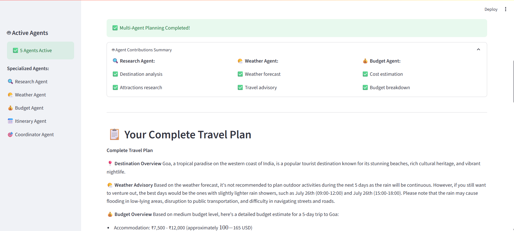
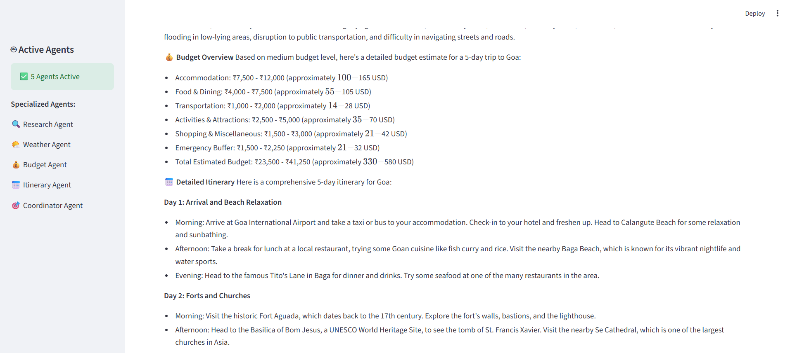
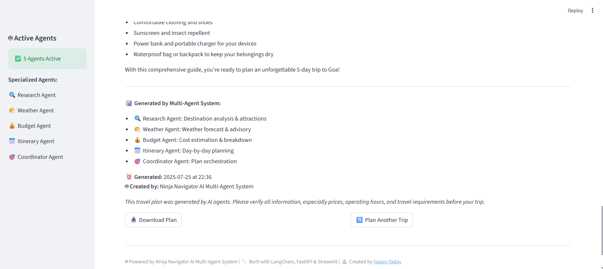
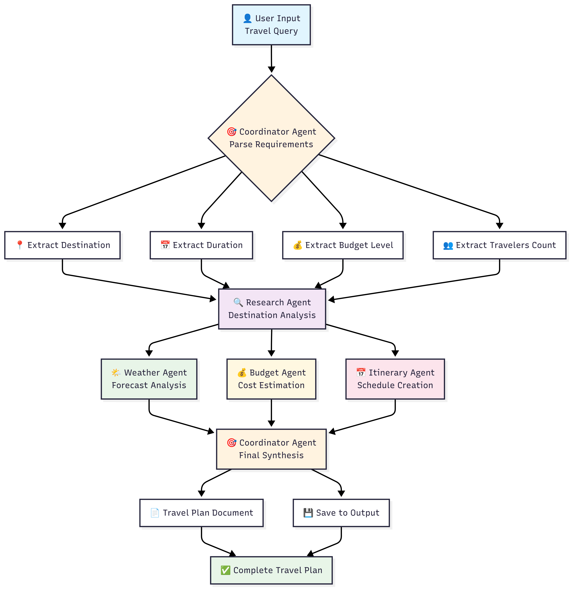
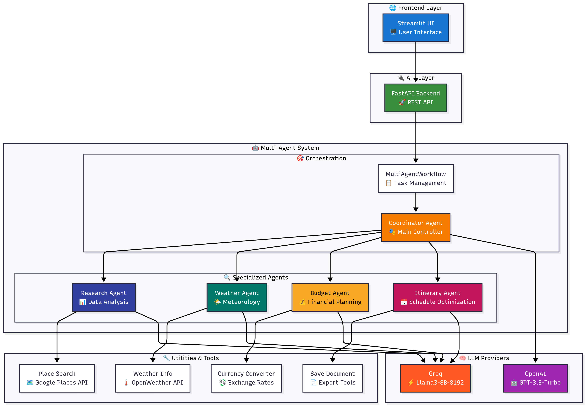
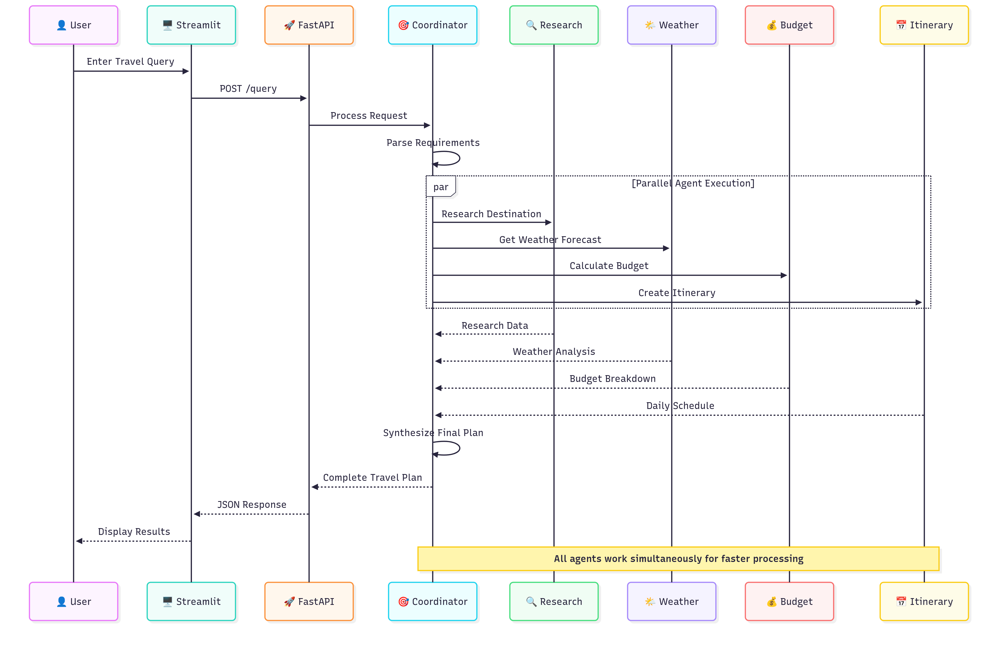

# 🤖 **Ninja Navigator AI** – Multi-Agent Travel Planning System

## **Problem Statement**

**Travel planning** is complex, time-consuming, and often inefficient when handled manually or via single-agent systems. Users must juggle information from different domains—destinations, weather, budget, scheduling—leading to fragmented or generic plans.

### **Why AI Multi-Agent Systems?**

AI **multi-agent systems** allow for **domain-specific expertise**, parallel processing, and fault tolerance—making them ideal for dynamic, high-context tasks like travel planning. Each agent contributes focused intelligence, and together they produce **faster**, **more personalized**, and **more reliable** travel solutions.

---

## 🚀 **Project Description**

**Ninja Navigator AI** is a multi-agent orchestration system designed to deliver **intelligent, actionable travel plans** based on a user’s natural language query. It harnesses multiple specialized agents that work independently and collaboratively to research, analyze, and generate complete itineraries.

### 🔹 Agent Responsibilities

| Agent                 | Role                                                                         |
| --------------------- | ---------------------------------------------------------------------------- |
| **Coordinator Agent** | Manages query parsing, agent execution, synthesis, and error fallback        |
| **Research Agent**    | Identifies attractions, culture, safety, local insights                      |
| **Weather Agent**     | Retrieves forecasts, recommends weather-based activities and packing items   |
| **Budget Agent**      | Estimates costs, performs currency conversion, suggests budget optimizations |
| **Itinerary Agent**   | Generates optimized, weather-aware, budget-constrained daily plans           |


### 🧠 How They Work Together

1. **User Input** → Natural language travel query
2. **Coordinator Agent** extracts requirements
3. **All agents execute concurrently** via `asyncio`
4. **Results are aggregated** and passed through a synthesis pipeline
5. **Final travel plan is generated** in structured markdown format, with export options

### 🔧 Live System Demonstration

## 🎨 User Interface Overviewassets/


## 🤖 Multi-Agent Execution in Action


## 📄 Generated Travel Plans




---

## 🧰 **Tools, Libraries, and Frameworks Used**

### 🧠 Multi-Agent & LLM Orchestration

| Tool          | Why Used                                                 |
| ------------- | -------------------------------------------------------- |
| **LangChain** | For agent definition, chaining, and memory management    |
| **LangGraph** | To manage execution flow and dependencies between agents |
| **asyncio**   | Enables concurrent agent execution for performance       |

### ⚙️ Backend, Frontend & Dev Tools

| Tool          | Why Used                                                        |
| ------------- | --------------------------------------------------------------- |
| **FastAPI**   | High-speed backend framework with automatic API docs            |
| **Streamlit** | Interactive frontend to input queries and show real-time status |
| **Pydantic**  | Data validation for API schema and config management            |
| **Husky**     | Enforces Git hooks to maintain code quality                     |
| **UV**        | Lightweight, fast package manager alternative to pip            |

### 🌐 APIs Integrated

| API                   | Purpose                                      |
| --------------------- | -------------------------------------------- |
| **Google Places**     | Attraction and location data                 |
| **OpenWeatherMap**    | Weather forecasting and climate data         |
| **Tavily Search**     | Real-time contextual and local data          |
| **Exchange Rate API** | Currency conversion and budget normalization |

---

## 🤖 **LLM Selection**

| Model                      | Tier      | Why Selected                                                |
| -------------------------- | --------- | ----------------------------------------------------------- |
| **Llama3-8B-8192 (Groq)**  | Free      | High token throughput (30k TPM), fast for agent-level tasks |
| **GPT-3.5 Turbo (OpenAI)** | Free/Paid | Better reasoning and coherence for final plan synthesis     |

These models offer a **balance between speed and intelligence**, ideal for multi-agent collaboration with structured and natural output needs.

## 📊 System Design

### 🔄 Multi-Agent Workflow


### 🤖 System Architecture


### 🏗️ Data Flow Sequence


---

## 🔮 **Future Enhancements: MCP Integration**

Future versions of Ninja Navigator AI will integrate with **Modular Commerce Platforms (MCPs)** for **real-time bookings and confirmations**, turning travel plans into **executable itineraries**.

| Feature                 | Target Platform                  |
| ----------------------- | -------------------------------- |
| ✈️ Flight Bookings      | Amadeus, Skyscanner API          |
| 🏨 Hotel Reservations   | Booking.com, Airbnb              |
| 🚖 Local Transport      | Uber, Rome2Rio                   |
| 🎟️ Activities & Events | Eventbrite, Viator, GetYourGuide |

This will transform the system into a **fully autonomous travel companion**—from planning to bookings.

---

## 🛠️ **Installation & Setup**

### 🔧 Prerequisites

* Python 3.8+
* Git
* [UV Package Manager](https://github.com/astral-sh/uv) *(Recommended)*

---

### 📦 Setup Instructions

```bash
# 1️ Clone the project
git clone https://github.com/happyrao78/ninja-navigator-ai
cd ninja-navigator-ai

# 2️ Create a virtual environment
uv venv --python "your python version"

# 3️ Activate environment
# Windows:
.venv\Scripts\activate
# Mac/Linux:
source .venv/bin/activate

# 4️ Install dependencies
uv pip install -r requirements.txt

# 5️ Configure environment
cp .env.name .env  # Rename sample file
# Fill in your API keys

# 6️ Start backend server
uvicorn main:app --reload --port 8000

# 7️ Launch frontend UI
streamlit run streamlit_app.py
```

---

##  Architected By

**Happy Yadav**
🔗 [LinkedIn](https://www.linkedin.com/in/happy-yadav-16b2a4287/)
🌐 [Portfolio](https://www.yadavhappy.in)

---